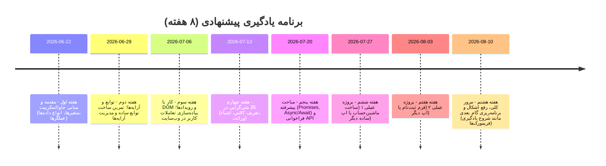

# مخزن **JavaScript-learning** (آموزش جاوااسکریپت)

**خلاصه اجرایی:** این مخزن آموزشی همراه با دوره «جاوااسکریپت صفر تا صد» آکادمی سبزلرن تهیه شده است و هدف آن تسهیل یادگیری گام‌به‌گام زبان جاوااسکریپت می‌باشد. تمرکز این دوره بر پوشش همه مباحث از مبانی تا پیشرفته JavaScript به‌صورت پروژه‌محور است. در این README، ساختار پوشه‌ها، اهداف یادگیری، پیش‌نیازها، دستورات اجرا و تطبیق درس‌ها با محتویات کد توضیح داده شده است.

## توضیح کوتاه
این پروژه شامل کدها و مثال‌های آموزشی مربوط به دوره **“آموزش جاوااسکریپت مقدماتی تا پیشرفته”** در سایت سبزلرن است. در این دوره، مفاهیمی مانند متغیرها، انواع داده‌ها، عملگرها، توابع، آرایه‌ها، شی‌گرایی (OOP)، DOM، رویدادها و مباحث پیشرفته مانند Async/Await آموزش داده می‌شود. هدف نهایی تسلط بر جاوااسکریپت و پیاده‌سازی سایت‌های وب پویا و حرفه‌ای است.

## اهداف یادگیری
- درک و استفاده از **متغیرها، انواع داده‌ها، عملگرها** و ساختارهای کنترلی (شرطی و حلقه‌ها).
- تعریف و فراخوانی **توابع**، ارسال پارامتر و بازگرداندن مقدار.
- کار با **آرایه‌ها** برای ذخیره و دستکاری مجموعه داده‌ها.
- مفهوم **شی‌گرایی (OOP)** در جاوااسکریپت: تعریف اشیاء، کلاس‌ها و وراثت.
- تعامل با **DOM و رویدادها**: پاسخ به کلیک‌ها، تغییرات فرم و سایر تعاملات کاربر.
- مدیریت خطاها با **try-catch** و آشنایی با **Async/Await** برای برنامه‌نویسی ناهمگام.
- فراخوانی و نمایش داده‌ها از طریق **APIها** با استفاده از Fetch یا روش‌های مشابه.
- پیاده‌سازی پروژه‌های واقعی مانند **ماشین‌حساب، فرم ثبت‌نام، مدیریت ورودی‌ها** و … برای تمرین عملی.

## پیش‌نیازها
- **دانش پایه HTML و CSS:** آشنایی با مفاهیم اولیه HTML و CSS برای شرکت در این دوره ضروری است.
- **ویرایشگر متن یا IDE:** مانند VS Code برای نوشتن و ویرایش کدهای جاوااسکریپت.
- **مرورگر وب:** مانند Chrome یا Firefox برای اجرای کدهای جاوااسکریپت و مشاهده خروجی.
- **آشنایی مختصر با مفاهیم برنامه‌نویسی:** (الگوریتم و فلوچارت) می‌تواند فرآیند یادگیری را تسریع کند.
- **نرم‌افزارهای جانبی:** در صورت استفاده از کتابخانه یا چارچوب خاص، نصب Node.js یا ابزارهای مرتبط لازم است (در این مخزن عمدتاً مثال‌های ساده JS داریم).

## ساختار پوشه‌ها و فایل‌ها

| پوشه/فایل        | محتویات                                       | بخش مرتبط با دوره                          |
|------------------|-----------------------------------------------|--------------------------------------------|
| `basics/`        | مباحث پایه: متغیرها، انواع داده، عملگرها، شرطی‌ها، حلقه‌ها | مفاهیم پایه جاوااسکریپت       |
| `functions/`     | تعریف و استفاده از توابع، پارامترها، بازگشت مقدار، آرایه‌ها | توابع و آرایه‌ها              |
| `oop/`           | شی‌گرایی: اشیاء، کلاس‌ها، وراثت                | شی‌گرایی در جاوااسکریپت      |
| `dom-events/`    | کار با DOM و رویدادها: دستکاری عناصر صفحه، کلیک‌ها و رویدادها | مدیریت رویدادها در جاوااسکریپت |
| `async/`         | مباحث پیشرفته: `Async`/`Await`، Promises، فراخوانی API (Fetch) | مباحث پیشرفته (Async/Await، APIها) |
| `projects/`      | پروژه‌های نمونه: ماشین‌حساب، فرم ثبت‌نام و دیگر پروژه‌های تمرینی | نمونه پروژه‌های عملی دوره       |
| `exercises/`     | تمرین‌های کدنویسی و چالش‌های کوچک (در صورت وجود)  | تمرین‌های مرتبط با هر فصل (مشخص نیست)      |
| `solutions/`     | راه‌حل‌های تمرین‌ها (در صورت وجود)             | پاسخ به تمرین‌های دوره (مشخص نیست)         |
| `README.md`      | این فایل                                        | راهنمای مخزن و توضیحات پروژه             |
| `.gitignore`     | فایل نادیده‌گیر‌های گیت (در صورت وجود)         | -                                          |
| `LICENSE`        | مجوز پروژه (در صورت وجود)                       | -                                          |

*توجه:* محتوای دقیق پوشه‌ها بسته به نگارش فعلی مخزن ممکن است متفاوت باشد. موارد فوق بر اساس نام‌های معمول و سرفصل‌های دوره فرض شده‌اند. بخش‌های `exercises` و `solutions` ممکن است در این مخزن وجود نداشته باشند یا برای پر کردن تمرین‌ها لازم باشد.

## نحوه اجرا و تست کدها

برای اجرای مثال‌ها و پروژه‌های این مخزن، مراحل زیر پیشنهاد می‌شود:

| دستور/گام                             | هدف                               | نتیجه مورد انتظار                         |
|--------------------------------------|-----------------------------------|-------------------------------------------|
| `git clone https://github.com/mohamadrezarajabi/Javascript-learning.git` | دانلود مخزن روی کامپیوتر شما | پوشه پروژه روی سیستم شما کپی می‌شود.       |
| `cd Javascript-learning`             | ورود به پوشه پروژه                 | در دایرکتوری پروژه قرار می‌گیرید.          |
| `npm install` (در صورت وجود)         | نصب وابستگی‌های لازم               | پوشه `node_modules` ایجاد و کتابخانه‌ها نصب می‌شوند. |
| **راه‌اندازی سرور محلی:**<br>`npm start` یا `python -m http.server` یا بازکردن `index.html`  | مشاهده پروژه‌ها در مرورگر           | پروژه در `http://localhost:8000` (یا `index.html`) اجرا می‌شود و خروجی در مرورگر قابل مشاهده است. |
| باز کردن فایل‌های `.html` یا `.js` در ویرایشگر و ریفرش مرورگر | بررسی و تست کدها پس از هر تغییر     | تغییرات در خروجی صفحه وب مشاهده می‌شود.    |

در صورت استفاده از چارچوب یا ابزار خاص، دستورهای اختصاصی آنها را نیز اجرا کنید. مطمئن شوید که بسته‌های مورد نیاز (در صورت اشاره در مستندات) نصب شده باشند.

## تطبیق محتوای مخزن با سرفصل‌های دوره

نمودار زیر ارتباط بین پوشه‌های مخزن و سرفصل‌های اصلی دوره را نشان می‌دهد.  
```mermaid
flowchart TD
    A(مفاهیم پایه<br/> (متغیرها، حلقه‌ها)) -->|مربوط به| B(پوشه `basics/`)
    C(توابع و آرایه‌ها) -->|مربوط به| D(پوشه `functions/`)
    E(شی‌گرایی (OOP)) -->|مربوط به| F(پوشه `oop/`)
    G(DOM و رویدادها) -->|مربوط به| H(پوشه `dom-events/`)
    I(مباحث پیشرفته: Async/Await, API) -->|مربوط به| J(پوشه `async/`)
    K(پروژه‌های عملی دوره) -->|مربوط به| L(پوشه `projects/`)
```  
توضیح: هر موضوع اصلی دوره در جدول ساختار پوشه‌های بالا مشخص شده است. برای مثال مفاهیم پایه‌ شامل متغیرها و حلقه‌ها، در فولدر `basics/` کد زده شده و به عنوان مبنای فصل مربوطه عمل می‌کند.

## برنامه زمانی پیشنهادی (۸ هفته)



این برنامه پیشنهادی کلی برای پوشش مباحث دوره همراه با انجام پروژه‌های عملی است. بسته به سرعت یادگیری خود می‌توانید در هر هفته بیش از یک موضوع را مطالعه کنید.

## مثال‌ها و تکه‌کدها

در ادامه مثال‌هایی ساده از کد جاوااسکریپت آورده شده است:

```js
// یک تابع ساده برای جمع دو عدد
function جمع(a, b) {
  return a + b;
}
console.log(جمع(2, 3)); // خروجی: 5

// کار با DOM: تغییر متن یک عنصر با شناسه "message"
document.getElementById("message").textContent = "سلام دنیا!";
```

می‌توانید کدهای بالا را در پوشه‌های مربوطه در مخزن پیدا کرده و آن‌ها را اجرا یا ویرایش کنید.

## راهنمای مشارکت

از مشارکت شما در بهبود این مخزن استقبال می‌کنیم. اگر ایده یا کد مفیدی برای اضافه‌کردن دارید، می‌توانید طبق نمودار زیر پیش بروید:

```mermaid
flowchart LR
    A[فورک کردن مخزن] --> B[کلون مخزن روی سیستم]
    B --> C[ایجاد شاخه (branch) جدید برای تغییرات]
    C --> D[اعمال تغییرات و **کامیت** (commit)]
    D --> E[ارسال **Pull Request** به مخزن اصلی]
    E --> F[بررسی کد و دریافت بازخورد از تیم نگهدارنده]
    F --> G[ادغام (merge) تغییرات پس از تایید]
```

- لطفاً هنگام ارسال **Pull Request** توضیحات شفاف در مورد تغییرات بنویسید.
- مسائل (Issues) و پیشنهادهای خود را در بخش مربوطه در گیت‌هاب ثبت کنید.
- افزون بر این، با دادن امتیاز (Star) و بازنشر این پروژه، ما را در بهبود آن یاری کنید.

## مجوز (License)

این پروژه (در صورت وجود) تحت مجوز **MIT** منتشر خواهد شد. در فایل `LICENSE` مشخصات کامل مجوز آمده است.  


## نشان‌ها (Badges)

<p>
<a href="#"></a>
<a href="#"></a>
<a href="#"></a>
</p>

## سوالات متداول

- **۱. آیا این دوره مناسب افراد بدون تجربه برنامه‌نویسی است؟**  
  بله، این دوره به‌طور گام‌به‌گام همه مفاهیم جاوااسکریپت را از ابتدا آموزش می‌دهد. فقط لازم است با HTML و CSS پایه آشنا باشید.

- **۲. مدت زمان دوره چقدر است و چه پروژه‌هایی دارد؟**  
  دوره حدود ۷۹ ساعت ویدیوی آموزشی دارد. پروژه‌هایی مانند *ماشین‌حساب*، *فرم ثبت‌نام* و مدیریت ورودی‌ها در طول دوره اجرا می‌شوند.

- **۳. برای تمرین جاوااسکریپت به چه نرم‌افزاری نیاز است؟**  
  تنها نیاز به یک ویرایشگر کد (مثل VSCode) و مرورگر وب (Chrome, Firefox و غیره) دارید. ابزار خاص دیگری ضروری نیست.

- **۴. دوره شامل مباحث پیشرفته مانند Async/Await است؟**  
  بله، مباحث پیشرفته از جمله **Async/Await** در این دوره تدریس می‌شود.

## گام‌های بعدی

پس از کامل کردن مباحث پایه و پروژه‌های این دوره، برای حرفه‌ای‌تر شدن می‌توانید به یادگیری موارد زیر بپردازید:

- فریم‌ورک‌های جاوااسکریپت (React, Vue, Angular) برای ساخت برنامه‌های پیچیده.
- **Node.js** و توسعه سمت سرور برای ساخت REST API و وب‌سرویس‌ها.
- مفاهیم پیشرفته مدیریت وضعیت (Redux) و بهینه‌سازی عملکرد وب.
- شرکت در پروژه‌های متن‌باز و ساخت نمونه‌کار (portfolio) جهت نمایش مهارت‌ها.

## لیست کنترل بهبودهای مخزن

- اضافه کردن فایل **`LICENSE`** با انتخاب یک مجوز مناسب (مثلاً MIT).  
- افزودن توضیحات بیشتر در **README** (جزئیات هر پوشه، راهنماهای شروع سریع).  
- ایجاد فایل **`.gitignore`** برای نادیده‌گرفتن فایل‌های تولیدشده (مانند `node_modules/`).  
- مستندسازی هر بخش کد با نظرات (Comment) و مثال‌های بیشتر.  
- افزودن تست‌های واحد (Unit Tests) برای کدهای آموزشی (در صورت امکان).  
- اصلاح و یکدست کردن قالب کدها (Linting) و ساختار پوشه‌ها برای خوانایی بهتر.  
- به‌روزرسانی نشان‌ها (Badges) پس از انتشار نسخه‌های جدید.

نجوه اجرای پروژه‌ها، ساختار کدها و نکات مهم در بالا توضیح داده شدند. با مشارکت و بازخورد شما می‌توانیم این آموزش را بهبود دهیم و برای همه علاقه‌مندان فارسی‌زبان مفیدتر کنیم. 

